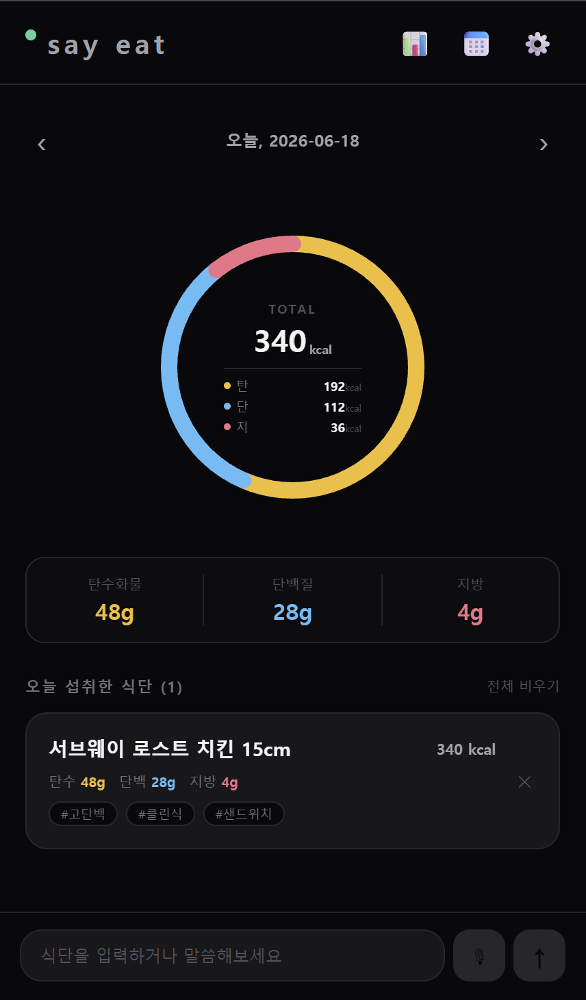

# say eat

> **말하면 기록된다.** 먹은 걸 말하거나 타이핑하면 AI가 알아서 영양소를 분석해줍니다.

<p align="center">
  
</p>

## 핵심 기능: 음성 입력

칼로리 앱의 최대 단점은 **입력이 귀찮다**는 것. say eat은 이걸 해결합니다.

```
"서브웨이 로스트 치킨 15cm 먹었어"
```

마이크 버튼을 누르고 먹은 걸 말하면 끝입니다. Gemini AI가 음식을 인식하고 탄수화물 · 단백질 · 지방 · 칼로리를 자동으로 계산해 기록합니다. 정확한 그램수를 몰라도 됩니다. 대략적으로 말해도 됩니다.

텍스트로 입력해도 동일하게 동작합니다.

## 주요 기능

- **음성 / 텍스트 입력** — 자연어로 식단 입력, AI가 영양소 자동 분석
- **도넛 차트** — 탄 · 단 · 지 비율을 한눈에 시각화
- **날짜별 기록** — 좌우 스와이프로 날짜 이동, 과거 식단 조회
- **주간 통계** — 7일치 섭취량 히스토그램
- **단백질 목표 설정** — 개인 목표 그램 설정 및 달성률 추적
- **커스텀 음식 등록** — 자주 먹는 음식을 직접 등록해 AI가 우선 참조

## 기술 스택

| 분류 | 기술 |
|---|---|
| 프레임워크 | Expo (React Native) |
| AI 분석 | Gemini 2.5 Flash |
| 인증 / DB | Firebase Auth + Firestore |
| 언어 | TypeScript |

## 라이선스

MIT
